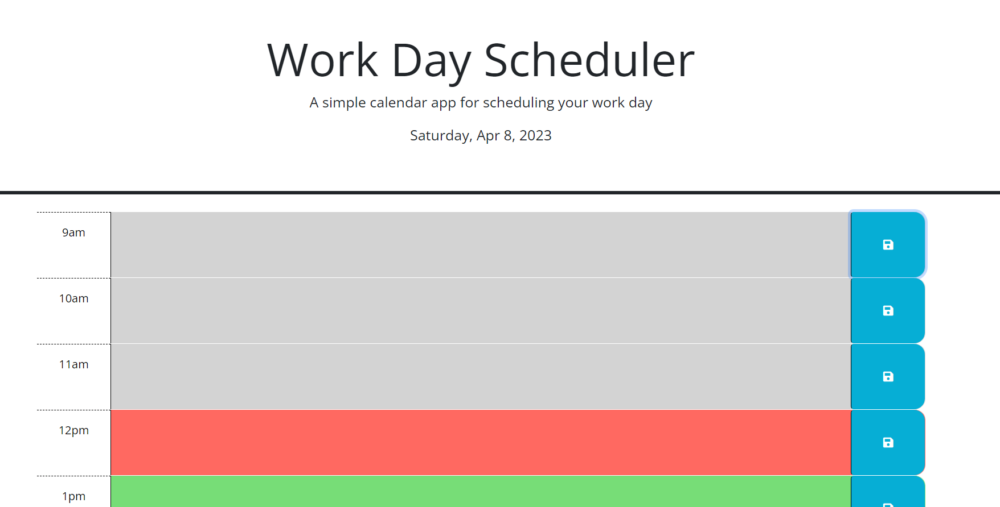

# workday-scheduler

## Description
This application provides a schedule for usual working hours, from 9 AM to 6 PM. The current date is shown in the header of the webapge. Each hour block is labeled with a time and has a text area in the middle that can be edited. Each time block is colored grey, red, or green, for time blocks in the past, present, and future, respectively. Each text area can be saved to local storage and are not erased when leaving or refreshing the page.

## Installation
N/A

## Deployed Page

## Usage
Access the deployed site at https://annie14254.github.io/workday-scheduler/. Choose time blocks and type your schedule into the text area in the middle. Press the blue save button next to that time block when you are done to save the text you have typed.

## Credits
N/A
